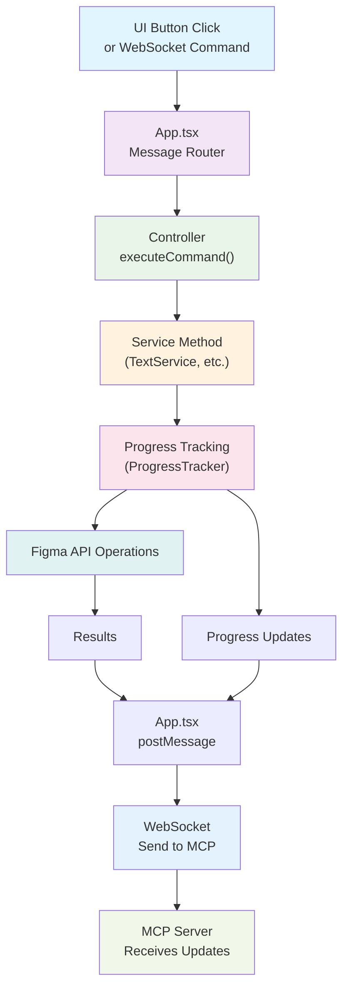

# 🎨 Figma Plugin with MCP Integration

A modern Figma plugin built with React, TypeScript, and WebSocket communication for MCP (Model Context Protocol) server integration. Features a sophisticated progress tracking system for long-running operations.

## 📋 Table of Contents

- [🏗️ Architecture](#️-architecture)
- [🚀 Progress Tracking](#-progress-tracking)
- [🔧 Setup & Development](#-setup--development)
- [📡 Communication Protocol](#-communication-protocol)
- [🛠️ Development Guide](#️-development-guide)
- [📄 License](#-license)

---

## 🏗️ Architecture

### System Overview



### Core Components

| Component | Responsibility |
|-----------|---------------|
| **App.tsx** | Central message router and command dispatcher |
| **Controller** | Pure command executor using FigmaCommand enum |
| **Services** | Domain-specific operations (Text, Layout, Creation, etc.) |
| **WebSocket** | Bi-directional communication with MCP server |
| **Progress Tracking** | Advanced system for long-running operations |

### Message Flow

```
Any Request → App.tsx → Controller → Figma API → Result → WebSocket → MCP Server
```

**Key Principle**: All requests flow through a unified pipeline regardless of source (UI or WebSocket), ensuring perfect consistency and automatic MCP integration.

---

## 🚀 Progress Tracking

Our plugin features a sophisticated progress tracking system that automatically handles different types of operations:

### 1. Instant Operations
For operations that complete immediately:

```typescript
async setTextContent(params: SetTextContentParams) {
  const node = await figma.getNodeByIdAsync(params.nodeId);
  await setCharacters(node, params.text);
  return { success: true, result };
}
```

### 2. Simple Progress Operations
For operations that benefit from basic progress tracking:

```typescript
async scanTextNodes(params: ScanTextNodesParams) {
  return await withProgress(
    params.commandId,
    "scan_text_nodes",
    "Starting text node scan...",
    "Text node scan completed successfully",
    async (tracker) => {
      const textNodes = [];
      // Business logic here
      return { success: true, count: textNodes.length, textNodes };
    }
  );
}
```

### 3. Bulk Data Processing
For operations processing large datasets with chunking:

```typescript
async processLargeDataset(items: Item[], chunkSize: number) {
  return await withChunkedProgress(
    generateCommandId(),
    "process_items",
    items,
    chunkSize,
    `Processing ${items.length} items...`,
    "All items processed successfully",
    async (chunk, chunkIndex, totalChunks, tracker) => {
      const results = [];
      for (const item of chunk) {
        const result = await processItem(item);
        results.push(result);
        await delay(5); // Prevent UI freezing
      }
      return results;
    }
  );
}
```

### 4. Complex Multi-Step Operations
For complex operations requiring manual progress control:

```typescript
async complexMultiStepOperation(params: ComplexParams) {
  const tracker = new ProgressTracker(params.commandId, "complex_operation");
  
  try {
    tracker.start("Starting complex operation...", 100);
    
    const data = await collectData();
    tracker.updatePercent(25, "Data collection completed");
    
    const processed = await processData(data);
    tracker.updatePercent(75, "Data processing completed");
    
    const result = await finalizeResults(processed);
    tracker.complete("Complex operation completed successfully!");
    
    return result;
  } catch (error) {
    tracker.error("Error in complex operation", error);
    throw error;
  }
}
```

### Progress Tracking Patterns

| Pattern | Use Case | Example |
|---------|----------|---------|
| **No Tracking** | Instant operations (<100ms) | Set text, get node info |
| **withProgress** | Simple operations (1-10s) | Scan nodes, create components |
| **withChunkedProgress** | Bulk processing (10s+) | Process 100+ items |
| **ProgressTracker** | Complex multi-step | Data analysis, batch operations |

### Best Practices

```typescript
// ✅ Good: Clear, actionable messages
tracker.start("Scanning 150 text nodes...");
tracker.update(75, "Processed 75/150 nodes");
tracker.complete("Found 23 text nodes requiring updates");

// ❌ Avoid: Vague or technical messages
tracker.start("Initializing...");
tracker.update(50, "Processing...");
tracker.complete("Done");
```

---

## 🔧 Setup & Development

### Prerequisites
- Node.js 16+
- Yarn or npm
- Figma Desktop App

### Installation

```bash
# Clone and install dependencies
git clone <repository-url>
cd figma-plugin-simple
yarn install

# Start development server
yarn dev
```

### Figma Plugin Setup
1. Open Figma Desktop App
2. Go to **Plugins** → **Development** → **Import plugin from manifest...**
3. Select the `manifest.json` file from this project
4. Run the plugin from the Plugins menu

### MCP Server Integration
The plugin automatically connects to WebSocket for MCP communication:
- **Development**: `ws://localhost:3055`
- **Production**: Configure in `websocket.ts`

### Project Structure
```
src/
├── app/
│   ├── components/          # React UI components
│   ├── styles/             # SCSS stylesheets
│   └── App.tsx             # Main app & message router
├── controller/
│   └── index.ts            # Command controller
├── services/               # Domain services (flat structure)
│   ├── TextService.ts      # Text operations
│   ├── CreationService.ts  # Node creation
│   ├── LayoutService.ts    # Auto-layout management
│   └── ...
├── utils/
│   ├── common.ts           # Progress tracking utilities
│   └── websocket.ts        # WebSocket communication
└── types/
    └── types.ts            # TypeScript interfaces
```

---

## 📡 Communication Protocol

### Component Architecture

```
MCP Server ←→ WebSocket Server ←→ Plugin UI ←→ Figma Plugin
    ↑                                              ↓
 (Claude)                                   (Figma API)
```

| Component | Role |
|-----------|------|
| **Figma Plugin** | Executes Figma API operations directly |
| **Plugin UI** | Central message router and WebSocket coordinator |
| **WebSocket Server** | Message relay between MCP Server and Plugin UI |
| **MCP Server** | Interface between Claude and WebSocket Server |

### Message Flow Patterns

#### WebSocket Command Flow
```
MCP Server → WebSocket → Plugin UI → Figma Plugin
     ↓           ↓            ↓           ↓
   Request   Broadcast   Store+Forward   Execute
     ↑           ↑            ↑           ↑
   Response   Relay Back   Route Back   Complete
```

#### Direct UI Command Flow
```
UI Button → Plugin UI → Figma Plugin
    ↓          ↓           ↓
  Click    Forward      Execute
    ↑          ↑           ↑
  Update   Display     Complete
```

### Message Formats

#### WebSocket Commands (MCP → Plugin)
```typescript
// Request
{
  id: string,           // Unique command ID
  command: string,      // Command name (e.g., "get_selection")
  params: object        // Command parameters
}

// Success Response
{
  id: string,           // Same as request ID
  result: unknown       // Command result
}

// Error Response
{
  id: string,           // Same as request ID
  error: string         // Error message
}
```

#### Progress Updates
```typescript
{
  type: "command_progress",
  commandId: "cmd_123456789",
  commandType: "scan_text_nodes",
  status: "in_progress",
  progress: 45,
  totalItems: 100,
  processedItems: 45,
  message: "Processed 45/100 items",
  timestamp: 1703123456789,
  payload: { /* additional data */ }
}
```

### Connection States
- **Connected**: Full MCP integration active
- **Disconnected**: Plugin works normally, MCP features unavailable
- **Reconnecting**: Automatic retry with exponential backoff

### Complete Operation Flow

```
1. Request: {id: "abc123", command: "scan_text_nodes", params: {...}}
   ↓
2. Controller → TextService.scanTextNodes()
   ↓
3. Progress Updates:
   - sendProgressUpdate(...) → figma.ui.postMessage({type: "command_progress", ...})
   ↓
4. App.tsx sends all progress messages to WebSocket
   ↓
5. Service completes → final result returned
   ↓
6. Controller → figma.ui.postMessage({type: "result", id: "abc123", result: {...}})
   ↓
7. App.tsx sends final result to WebSocket
```

#### MCP Server Received Messages
```
1. Progress: {type: "progress_update", data: {status: "started", progress: 0, ...}}
2. Progress: {type: "progress_update", data: {status: "in_progress", progress: 25, ...}}
3. Progress: {type: "progress_update", data: {status: "in_progress", progress: 50, ...}}
4. Progress: {type: "progress_update", data: {status: "in_progress", progress: 75, ...}}
5. Progress: {type: "progress_update", data: {status: "completed", progress: 100, ...}}
6. Result:   {id: "abc123", result: {success: true, textNodes: [...]}}
```

### Error Handling

If an error occurs during processing:

```typescript
// Error progress message
{
  "type": "command_progress",
  "commandId": "cmd_abc123def456",
  "commandType": "scan_text_nodes",
  "status": "error",
  "progress": 37,
  "totalItems": 387,
  "processedItems": 143,
  "message": "Error in chunked scan_text_nodes: Node not found",
  "timestamp": 1703123461890,
  "payload": { "error": "Node not found" }
}

// Error result
{
  "id": "cmd_abc123def456",
  "command": "scan_text_nodes",
  "params": { /* original params */ },
  "error": {
    "message": "Error in chunked scan_text_nodes: Node not found",
    "commandId": "cmd_abc123def456"
  }
}
```

---

## 🛠️ Development Guide

### Adding New Operations

Adding a new operation requires changes across multiple components. Follow this step-by-step guide:

#### Step 1: Add MCP Tool to Server
First, add the new tool to the MCP server (`src/talk_to_figma_mcp/server.ts`):

```typescript
// Add new tool definition
server.tool(
  "my_new_operation",
  "Description of what this operation does",
  {
    nodeId: z.string().describe("The ID of the node to operate on"),
    customParam: z.string().describe("Custom parameter description"),
    optionalParam: z.number().optional().describe("Optional parameter description"),
  },
  async ({ nodeId, customParam, optionalParam }) => {
    try {
      const result = await sendCommandToFigma("my_new_operation", {
        nodeId,
        customParam,
        optionalParam,
      });
      return {
        content: [
          {
            type: "text",
            text: `Operation completed: ${JSON.stringify(result)}`,
          },
        ],
      };
    } catch (error) {
      return {
        content: [
          {
            type: "text",
            text: `Error in operation: ${error instanceof Error ? error.message : String(error)}`,
          },
        ],
      };
    }
  }
);
```

#### Step 2: Define Command in Types
Add the command and parameters to the shared types (`src/types/types.ts`):

```typescript
// types/types.ts
export enum FigmaCommand {
  // ... existing commands
  MY_NEW_OPERATION = "my_new_operation"
}

export interface MyNewOperationParams extends BaseNodeParams {
  customParam: string;
  optionalParam?: number;
}
```

#### Step 3: Implement Service Method
Create or update the appropriate service in the plugin (`src/figma-plugin-simple/src/services/`):

```typescript
// services/MyService.ts
import { withProgress, ProgressTracker } from "../utils/common";

export class MyService {
  async myNewOperation(params: MyNewOperationParams) {
    // Choose appropriate pattern based on operation complexity:
    
    // Pattern A: Simple operation
    return await withProgress(
      params.commandId,
      "my_new_operation",
      "Starting operation...",
      "Operation completed",
      async (tracker) => {
        // Your Figma API logic here
        const node = await figma.getNodeByIdAsync(params.nodeId);
        // ... perform operations
        return result;
      }
    );
    
    // Pattern B: Bulk processing
    return await withChunkedProgress(/* ... */);
    
    // Pattern C: Complex multi-step
    const tracker = new ProgressTracker(params.commandId, "my_new_operation");
    // Manual control...
  }
}
```

#### Step 4: Add to Controller
Update the controller to handle the new command (`src/figma-plugin-simple/src/controller/index.ts`):

```typescript
// controller/index.ts
case FigmaCommand.MY_NEW_OPERATION:
  result = await myService.myNewOperation(params as MyNewOperationParams);
  break;
```

#### Step 5: Build and Deploy MCP Server
After making changes to the server, rebuild and deploy:

```bash
# Navigate to MCP server directory
cd src/talk_to_figma_mcp

# Build the server
bun run build

# Test the server locally
bunx cursor-talk-to-figma-mcp
```

#### Step 6: Test and Build Plugin
For the Figma plugin changes:

```bash
# Navigate to plugin directory
cd src/figma-plugin-simple

# Test in development mode
npm run dev

# If everything works, build for production
npm run build
```

#### Step 7: Restart Cursor
Restart Cursor to pick up the new MCP tools, then test the new operation end-to-end.

### Key Features

#### 🎯 Unified Command Processing
- Single `executeCommand()` function handles all commands
- No duplicate logic between WebSocket and UI paths
- Consistent parameter validation and error handling

#### 🔄 Smart Response Routing
- Plugin detects command source via `webSocketCommandId`
- Automatic response format selection
- Proper cleanup of completed/failed commands

#### 🛡️ Robust Error Handling
- Consistent error format across all paths
- Proper error propagation to appropriate destinations
- Timeout handling and connection state management

#### ⚡ Performance Optimizations
- No unnecessary message transformations
- Efficient command routing and state management
- Minimal memory footprint for pending commands

### Implementation Notes

- **Backward Compatibility**: Existing cursor_mcp_plugin continues to work unchanged
- **Type Safety**: Full TypeScript support with proper interfaces
- **Architecture**: Clean, maintainable, and efficient communication system

---

## 📄 License

MIT License - see LICENSE file for details.
