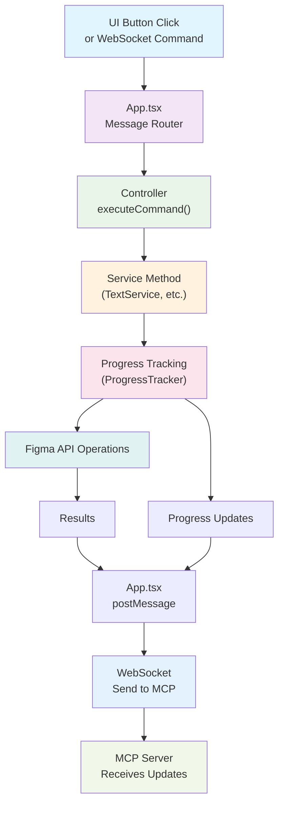

# 🎨 Figma Plugin with MCP Integration & Advanced Progress Tracking

A modern Figma plugin built with React, TypeScript, and WebSocket communication for MCP (Model Context Protocol) server integration. Features a sophisticated progress tracking system for long-running operations.

## 🏗️ Architecture Overview



### **Simplified Message Flow**
```
Any Request → App.tsx → Controller → Figma API → Result → WebSocket → MCP Server
```

**Key Principle**: All requests flow through a unified pipeline regardless of source (UI or WebSocket), ensuring perfect consistency and automatic MCP integration.

### **Core Components**

- **App.tsx**: Central message router and command dispatcher
- **Controller**: Pure command executor using FigmaCommand enum
- **Services**: Domain-specific operations (Text, Layout, Creation, etc.)
- **WebSocket**: Bi-directional communication with MCP server
- **Progress Tracking**: Advanced system for long-running operations

---

## 🚀 Progress Tracking System

Our plugin features a sophisticated progress tracking system that automatically handles different types of operations:

### **1. Instant Operations**
For operations that complete immediately without progress tracking:

```typescript
// Simple operations - no progress tracking needed
async setTextContent(params: SetTextContentParams) {
  const node = await figma.getNodeByIdAsync(params.nodeId);
  await setCharacters(node, params.text);
  return { success: true, result };
}
```

### **2. Simple Progress Operations**
For operations that benefit from basic progress tracking:

```typescript
// Using withProgress helper
async scanTextNodes(params: ScanTextNodesParams) {
  return await withProgress(
    params.commandId,
    "scan_text_nodes",
    "Starting text node scan...",
    "Text node scan completed successfully",
    async (tracker) => {
      const textNodes = [];
      // Your business logic here
      if ("children" in node || node.type === "TEXT") {
        await this.findTextNodes(node, [], 0, textNodes);
      }
      
      return {
        success: true,
        count: textNodes.length,
        textNodes
      };
    }
  );
}
```

### **3. Bulk Data Processing**
For operations processing large datasets with chunking:

```typescript
// Using withChunkedProgress helper
async processLargeDataset(items: Item[], chunkSize: number) {
  return await withChunkedProgress(
    generateCommandId(),
    "process_items",
    items,
    chunkSize,
    `Processing ${items.length} items...`,
    "All items processed successfully",
    async (chunk, chunkIndex, totalChunks, tracker) => {
      const results = [];
      
      // Process each item in the chunk
      for (const item of chunk) {
        const result = await processItem(item);
        results.push(result);
        
        // Small delay to prevent UI freezing
        await delay(5);
      }
      
      return results;
    }
  );
}
```

### **4. Complex Multi-Step Operations**
For complex operations requiring manual progress control:

```typescript
// Using ProgressTracker directly
async complexMultiStepOperation(params: ComplexParams) {
  const tracker = new ProgressTracker(params.commandId, "complex_operation");
  
  try {
    tracker.start("Starting complex operation...", 100);
    
    // Step 1: Data collection
    const data = await collectData();
    tracker.updatePercent(25, "Data collection completed");
    
    // Step 2: Processing
    const processed = await processData(data);
    tracker.updatePercent(75, "Data processing completed");
    
    // Step 3: Finalization
    const result = await finalizeResults(processed);
    tracker.complete("Complex operation completed successfully!");
    
    return result;
    
  } catch (error) {
    tracker.error("Error in complex operation", error);
    throw error;
  }
}
```

---

## 🛠️ Development Guide

### **Project Structure**
```
src/
├── app/
│   ├── components/          # React UI components
│   ├── styles/             # SCSS stylesheets
│   └── App.tsx             # Main app & message router
├── controller/
│   └── index.ts            # Command controller
├── services/               # Domain services (flat structure)
│   ├── TextService.ts      # Text operations
│   ├── CreationService.ts  # Node creation
│   ├── LayoutService.ts    # Auto-layout management
│   └── ...
├── utils/
│   ├── common.ts           # Progress tracking utilities
│   └── websocket.ts        # WebSocket communication
└── types/
    └── types.ts            # TypeScript interfaces
```

### **Adding New Operations**

#### **Step 1: Define Command in Types**
```typescript
// types/types.ts
export enum FigmaCommand {
  // ... existing commands
  MY_NEW_OPERATION = "my_new_operation"
}

export interface MyNewOperationParams extends BaseNodeParams {
  customParam: string;
  optionalParam?: number;
}
```

#### **Step 2: Implement Service Method**
```typescript
// services/MyService.ts
import { withProgress, ProgressTracker } from "../utils/common";

export class MyService {
  async myNewOperation(params: MyNewOperationParams) {
    // Choose appropriate pattern based on operation complexity:
    
    // Pattern A: Simple operation
    return await withProgress(
      params.commandId,
      "my_new_operation",
      "Starting operation...",
      "Operation completed",
      async (tracker) => {
        // Your logic here
        return result;
      }
    );
    
    // Pattern B: Bulk processing
    return await withChunkedProgress(/* ... */);
    
    // Pattern C: Complex multi-step
    const tracker = new ProgressTracker(params.commandId, "my_new_operation");
    // Manual control...
  }
}
```

#### **Step 3: Add to Controller**
```typescript
// controller/index.ts
case FigmaCommand.MY_NEW_OPERATION:
  result = await myService.myNewOperation(params as MyNewOperationParams);
  break;
```

### **Progress Tracking Best Practices**

#### **When to Use Each Pattern**

| Pattern | Use Case | Example |
|---------|----------|---------|
| **No Tracking** | Instant operations (<100ms) | Set text, get node info |
| **withProgress** | Simple operations (1-10s) | Scan nodes, create components |
| **withChunkedProgress** | Bulk processing (10s+) | Process 100+ items |
| **ProgressTracker** | Complex multi-step | Data analysis, batch operations |

#### **Progress Message Guidelines**

```typescript
// ✅ Good: Clear, actionable messages
tracker.start("Scanning 150 text nodes...");
tracker.update(75, "Processed 75/150 nodes");
tracker.complete("Found 23 text nodes requiring updates");

// ❌ Avoid: Vague or technical messages
tracker.start("Initializing...");
tracker.update(50, "Processing...");
tracker.complete("Done");
```

---

## 🔧 Setup & Development

### **Prerequisites**
- Node.js 16+
- Yarn or npm
- Figma Desktop App

### **Installation**
```bash
# Clone and install dependencies
git clone <repository-url>
cd figma-plugin-simple
yarn install

# Start development server
yarn dev
```

### **Figma Plugin Setup**
1. Open Figma Desktop App
2. Go to **Plugins** → **Development** → **Import plugin from manifest...**
3. Select the `manifest.json` file from this project
4. Run the plugin from the Plugins menu

### **MCP Server Integration**
The plugin automatically connects to WebSocket for MCP communication:
- **Development**: `ws://localhost:3055`
- **Production**: Configure in `websocket.ts`

---

## 📡 WebSocket Communication

### **Message Format**
```typescript
// Command execution
{
  id: "cmd_123456789",
  command: "scan_text_nodes",
  params: {
    nodeId: "123:456",
    chunkSize: 10,
    commandId: "cmd_123456789"
  }
}

// Progress updates
{
  type: "command_progress",
  commandId: "cmd_123456789",
  commandType: "scan_text_nodes",
  status: "in_progress",
  progress: 45,
  totalItems: 100,
  processedItems: 45,
  message: "Processed 45/100 items",
  timestamp: 1703123456789,
  payload: { /* additional data */ }
}
```

### **Connection States**
- **Connected**: Full MCP integration active
- **Disconnected**: Plugin works normally, MCP features unavailable
- **Reconnecting**: Automatic retry with exponential backoff

---

## 🔄 Complete Long-Running Operation Flow

Here's a complete example showing how a long-running operation flows through the system and what messages the MCP Server receives:

```
1. Request: {id: "abc123", command: "scan_text_nodes", params: {...}}
   ↓
2. Controller → TextService.scanTextNodes()
   ↓
3. Updates from Service:
   - sendProgressUpdate(...) → figma.ui.postMessage({type: "command_progress", ...})
   - sendProgressUpdate(...) → figma.ui.postMessage({type: "command_progress", ...})
   - sendProgressUpdate(...) → figma.ui.postMessage({type: "command_progress", ...})
   ↓
4. App.tsx sends all progress messages to WebSocket
   ↓
5. Service completes → final result returned
   ↓
6. Controller → figma.ui.postMessage({type: "result", id: "abc123", result: {...}})
   ↓
7. App.tsx sends final result to WebSocket
```

### **MCP server Received Message example **

```
1. Progress: {type: "progress_update", data: {status: "started", progress: 0, ...}}
2. Progress: {type: "progress_update", data: {status: "in_progress", progress: 25, ...}}
3. Progress: {type: "progress_update", data: {status: "in_progress", progress: 50, ...}}
4. Progress: {type: "progress_update", data: {status: "in_progress", progress: 75, ...}}
5. Progress: {type: "progress_update", data: {status: "completed", progress: 100, ...}}
6. Result:   {id: "abc123", result: {success: true, textNodes: [...]}}
```


### **Error Handling Flow**

If an error occurs during processing:

```typescript
// Error progress message
{
  "type": "command_progress",
  "commandId": "cmd_abc123def456",
  "commandType": "scan_text_nodes",
  "status": "error",
  "progress": 37,
  "totalItems": 387,
  "processedItems": 143,
  "message": "Error in chunked scan_text_nodes: Node not found",
  "timestamp": 1703123461890,
  "payload": {
    "error": "Node not found"
  }
}

// Error result
{
  "id": "cmd_abc123def456",
  "command": "scan_text_nodes",
  "params": { /* original params */ },
  "error": {
    "message": "Error in chunked scan_text_nodes: Node not found",
    "commandId": "cmd_abc123def456"
  }
}
```


---

## 📄 License

MIT License - see LICENSE file for details.
